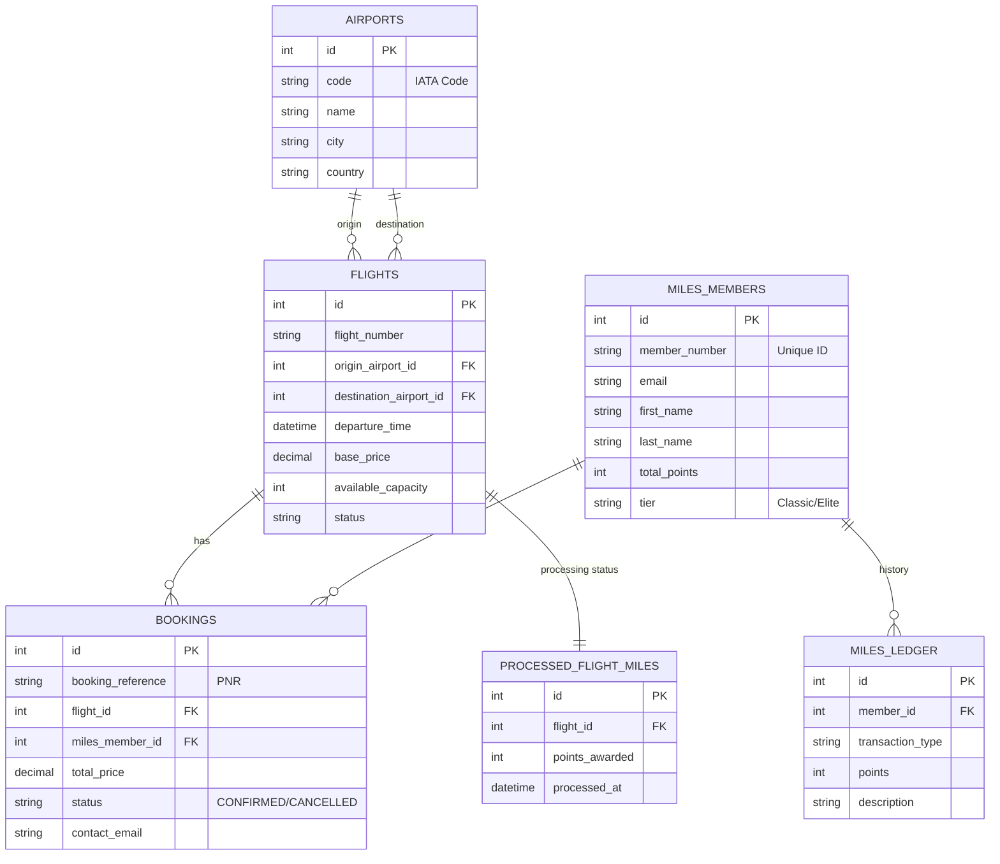

# Airline Ticketing System

Hello! This project is a modern, microservices-based airline ticketing system. Users can search for flights, buy tickets (using money or miles), and manage their bookings.

**GitHub Repository:** [https://github.com/nurettindemirell/AirlinesTicketSystem](https://github.com/nurettindemirell/AirlinesTicketSystem)

---

## Application URLs (Deployed Locally)

The project is currently configured to run on the local machine (localhost):

*   **Customer Portal:** [http://localhost:5174](http://localhost:5174)
    *   *You can search for flights and book tickets here.*
*   **Admin Portal:** [http://localhost:5173](http://localhost:5173)
    *   *Used for adding new flights and viewing price predictions (ML).*
*   **API Gateway:** [http://localhost:3000](http://localhost:3000)
    *   *The central entry point for all services.*

---

## Design and Architecture

I used a **Microservices Architecture** for this project. Each specific task runs in its own service, ensuring that if one part fails, the others continue to work.

### System Schema

The diagram below shows how the services communicate with each other:

![Architecture Diagram]

### What Do the Services Do?
1.  **Gateway Service:** Acts like a traffic controller. It routes all incoming requests to the relevant service.
2.  **Flight Service:** The core component. It lists flights and handles ticket sales (including inventory management).
3.  **Membership Service:** A loyalty system similar to "Miles & Smiles in the project". Members earn and spend points.
4.  **Messaging Service:** Listens to RabbitMQ and sends emails (Booking confirmations, Welcome emails).
5.  **Prediction Service (Python):** Calculates estimated flight prices based on duration using a Random Forest Model.

---

## Data Model (ER Diagram)

I used **Azure SQL** as the database and designed a relational schema.



---

## Assumptions and Issues Encountered

While building this project, I made several decisions and faced some challenges:

### 1. Assumptions
*   **Auth:** I assumed AWS Cognito would be used for authentication and did not build a custom login system.
*   **Payment:** There is no real bank integration; clicking "Pay" assumes the payment is successful.
*   **Miles:** Every flight awards points equal to "Duration x 10".

### 2. Issues and Solutions
*   **Issue:** What happens if two people try to buy the last seat at the same time? (Race Condition)
    *   **Solution:** I used an atomic query in the database: `UPDATE flights SET capacity = capacity - 1 WHERE capacity > 0`. This makes it impossible for the capacity to DROP below zero.
*   **Issue:** How should services communicate?
    *   **Solution:** For non-critical tasks (like sending emails), I used **RabbitMQ** (Queues). For tasks requiring immediate responses (like checking prices), I used HTTP.

---

## How to Run

To run the project on your machine:

1.  **Install Dependencies:**
    ```bash
    npm install
    # Or navigate into each folder and run npm install
    ```
2.  **Start Services:**
    Typically, open a separate terminal for each service and run `npm run dev`:

    *   `FlightService > npm run dev`
    *   `MembershipService > npm run dev`
    *   `GatewayService > npm run dev`
    *   `CustomerPortal > npm run dev`

---
**Submitted By:** Nurettin Demirel
